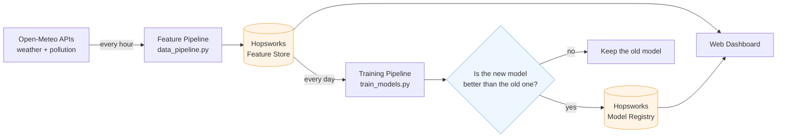
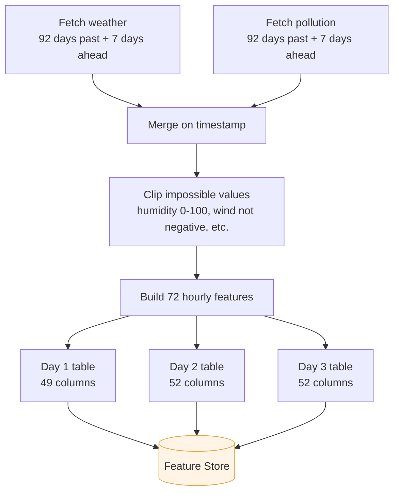
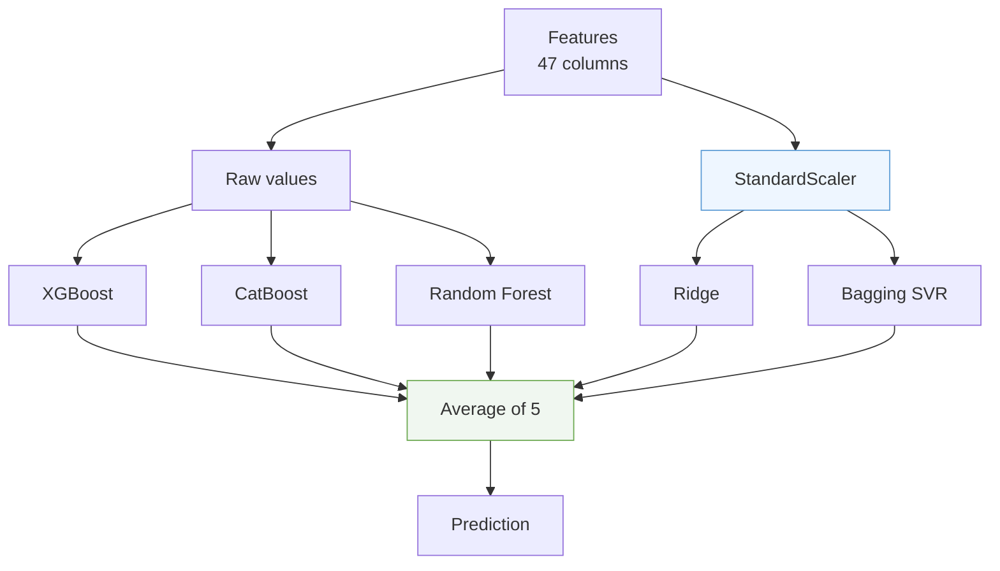
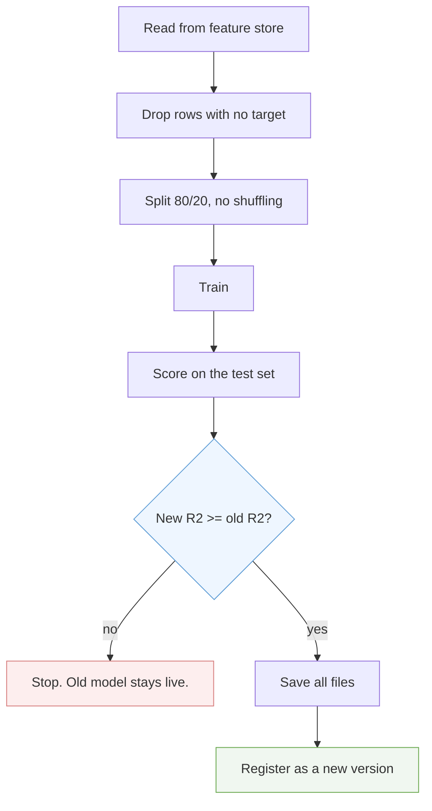

# Karachi AQI Predictor

This project predicts the Air Quality Index (AQI) for Karachi one, two, and three days ahead.

It runs by itself. Every hour a script pulls fresh weather and pollution data, builds features from it, and saves them to a feature store. Every day another script retrains the models and only replaces the old ones if the new ones score better. Nothing runs on my laptop.

Built for the 10Pearls Shine internship (Cohort 9, Data Sciences).

---

## Current status

| Piece | State |
|---|---|
| Feature pipeline (hourly) | Running on GitHub Actions |
| Training pipeline (daily) | Running on GitHub Actions |
| Feature store | 1,125 daily rows, Aug 2023 to today |
| Model registry | 3 models registered |
| Web dashboard | In progress |
| SHAP explanations | Done in notebooks |

---

## Results

The R2 score alone does not tell you much. A model can score 0.8 on an easy stretch of data and 0.4 on a hard one. So every score below is shown next to a **persistence baseline** — the dumbest possible forecast, which just says "tomorrow's AQI will be the same as today's".

The gap between the two is the part the model actually earned.

| Horizon | Model | R2 | Baseline R2 | Gain | MAE |
|---|---|---|---|---|---|
| Day 1 | Tuned XGBoost | 0.837 | 0.552 | **+0.285** | 5.37 |
| Day 2 | 5-model blend | 0.553 | 0.190 | **+0.363** | 9.11 |
| Day 3 | 5-model blend | 0.511 | -0.081 | **+0.592** | 9.84 |

Look at Day 3. The baseline is **negative**. That means at 72 hours out, today's AQI is a worse guess than just using the long-run average. There is almost no signal left in yesterday's number. The model still reaches 0.511 from weather forecasts and seasonal patterns, which is where the whole 0.592 gain comes from.

Day 1 is the only horizon that clears the 0.7 bar the brief asked for. Day 2 and Day 3 do not, and I do not think they can with this data. Three days out, air quality in Karachi is mostly driven by wind and weather systems that the forecast data only partly captures.

---

## How the whole thing fits together



Two scripts, two schedules, one shared store. The dashboard reads the model from the registry and the latest features from the feature store, then works out the prediction itself.

---

## The data

Everything comes from **Open-Meteo**. Two separate endpoints:

- **Weather** — temperature, wind speed, wind gusts, wind direction, humidity, dew point, surface pressure, boundary layer height, cloud cover, rainfall, solar radiation
- **Air quality** — PM2.5, PM10, carbon monoxide, nitrogen dioxide, sulphur dioxide, ozone, dust, aerosol optical depth, and the US AQI value itself

Location is fixed to Karachi (24.8608 N, 67.0104 E).

Both endpoints return hourly readings. The history goes back to **4 August 2023**, which gives a bit over two years of data and covers two full winter smog seasons.

### Why the data is daily, not hourly

I started with hourly rows. Then I built the same models on daily averages. The daily version was much better:

| Model | Hourly R2 | Daily R2 |
|---|---|---|
| XGBoost Day 1 | 0.625 | **0.836** |
| XGBoost Day 2 | 0.349 | **0.555** |
| XGBoost Day 3 | 0.292 | **0.503** |
| CatBoost Day 1 | 0.587 | **0.840** |

Averaging over a day smooths out the hour-to-hour noise — traffic spikes, one bad sensor reading, a passing gust. What is left is the actual daily pollution level, and that is what the models can learn.

The pipeline still **collects** hourly data. It has to, because the rolling windows and lag features need hourly resolution to be built correctly. It just aggregates to daily at the very end.

---

## Feature pipeline



### What features get built

**Time features** — hour, day of month, month, day of week, quarter.

**Lag features** — AQI one hour ago, AQI 24 hours ago, and the rate of change.

**Rolling statistics** — mean and standard deviation of AQI over the past 6, 24, and 72 hours, plus an exponentially weighted mean. All of them shifted by one hour first, so the current reading never leaks into its own rolling window.

**Future weather** — this is the important one. For ten weather variables, the pipeline pulls the value 24, 48, and 72 hours ahead and stores it as `f24_temperature_2m`, `f48_wind_speed_10m`, and so on. These are forecasts, not measurements, and they are what let the model see ahead at all.

**Domain features** — three that come from how pollution actually behaves:
- `wind_pollution_dispersion` = wind speed multiplied by boundary layer height. Strong wind plus a tall mixing layer means pollution spreads out and AQI drops.
- `pressure_change_3hour` = how much surface pressure moved in three hours. Catches weather systems moving in.
- `humidity_level` = temperature minus dew point. A cheap way to measure how dry the air is.

**Cyclic features** (Day 2 and Day 3 only) — sine and cosine of day-of-year and day-of-week. Without these, the model treats 31 December and 1 January as far apart, when they are next-door days with near-identical weather.

**Delta features** (Day 2 and Day 3 only) — future weather minus today's weather. Instead of "temperature will be 32 degrees", the model sees "temperature will be 4 degrees warmer than now". The change turned out to matter more than the level.

### Why the API endpoint had to change

The first version used Open-Meteo's **archive** endpoint. It worked for the backfill and gave clean history.

Then the live pipeline broke. Every `f24`, `f48`, and `f72` feature came out empty for the most recent rows.

The reason: those features are built with `shift(-24)`, which looks *forward* in the table. The archive endpoint only returns the past and lags a few days behind. There were no future rows to shift from.

The fix was to switch to the **forecast** endpoint with `past_days=92` and `forecast_days=7`. That returns history and forecast in one call, so the forward-looking features have real numbers in them right up to today.

One side effect worth knowing: the forecast endpoint holds roughly 77 days of history, not the 92 requested. The pollution endpoint gives all 92, the weather endpoint does not. So the merged window ends up around 76 usable days. That is fine — the pipeline is only topping up recent days, and the full history already sits in the feature store.

---

## Feature store

Three feature groups in Hopsworks, one per horizon.

```
aqi_daily_day1   50 columns   time + 48 features + 1 target
aqi_daily_day2   53 columns   time + 51 features + 1 target
aqi_daily_day3   53 columns   time + 51 features + 1 target
```

All three use `time` as the primary key and event time, with HUDI table format. That means **inserts are upserts**. If a day already exists it gets updated, if it is new it gets added. Running the pipeline twice in an hour does not create duplicates, and a missed run is fully repaired by the next one.

### The store holds more than the models use

The feature groups carry 51 features for Day 2 and Day 3, but the models only use 47. Four columns — `boundary_layer_height`, `f48/f72_boundary_layer_height`, `wind_pollution_dispersion` and `delta_boundary_layer_height` — sit in the store but get dropped before training.

They are there because the boundary layer readings have a lot of missing values, and dropping them helped the models. But the store keeps them anyway.

This split is on purpose. The feature store is a warehouse and the model picks what it needs from it. If I want to use `boundary_layer_height` again next month, it is already there and I do not have to rebuild two years of history.

### Today's row has no target

Every run, the pipeline writes today's row with all features filled in and the target column empty — because tomorrow's AQI has not happened yet.

That row is useless for training, and the training script drops it. But it is exactly the row the dashboard needs to make today's prediction. So the pipeline keeps it and lets the training script filter it out.

---

## Models

### What I tried

| Model | Day 1 R2 | Notes |
|---|---|---|
| Persistence baseline | 0.552 | "Tomorrow equals today" |
| Facebook Prophet (plain) | 0.003 | No better than guessing |
| Facebook Prophet (+ weather regressors) | 0.518 | Still below the baseline |
| LSTM | 0.590 | Slight gain, much more complexity |
| CatBoost | 0.840 | Very close to XGBoost |
| **Tuned XGBoost** | **0.837** | Picked this one |

Prophet was the biggest surprise. On its own it scored almost zero. It is built for series with a clear repeating shape, and daily AQI in Karachi does not have one strong enough to work with. Adding weather regressors pulled it up to 0.518, but that is still worse than the baseline, so it never earned its place.

LSTM did beat the baseline but not by much, and it needed scaling, sequence windows, and a lot more code to keep working. For the gain it gave, it was not worth putting into a pipeline that has to run unattended every day.

CatBoost and XGBoost finished within 0.003 of each other. I went with XGBoost for Day 1 because it trains in about 6 seconds versus CatBoost's much longer run, which matters when it retrains daily on shared CI hardware.

### Day 1: single tuned XGBoost

Tuned with `RandomizedSearchCV` — 100 random parameter combinations, scored with `TimeSeriesSplit` so the validation folds always come after the training folds. Regular k-fold would have let the model train on future data and predict the past, which inflates the score for no real reason.

The search found: 1800 trees, learning rate 0.01, depth 6, and fairly heavy regularisation.

**The search does not run in the pipeline.** It takes 30 to 40 minutes on GitHub's two-core runners, and it would find roughly the same answer every day. The winning parameters are written straight into `train_functions.py`, and the daily job just refits the model on updated data with those settings.

### Day 2 and Day 3: five models averaged

One model was not enough at longer horizons, so both use a blend of five:



The three tree models take the raw feature values. Trees split on thresholds, so the scale of a column does not matter to them.

Ridge and the bagged SVR take **scaled** values. Both are distance-based, so a column measured in hundreds would drown out a column measured in decimals if left alone.

This is why the fitted `StandardScaler` is saved to the registry alongside the five models. Forgetting it would not throw an error. It would just quietly feed Ridge and the SVR wrongly-scaled numbers and give bad predictions with no warning at all.

Each model folder holds seven files: five models, the scaler, and a `features.json` with the exact column order the model was trained on.

### Feature importance

SHAP was run on the Day 1 model to see what it is actually keying on. The top drivers were the AQI lag features and the rolling means, with the forecast wind and boundary layer variables next. That matches what the correlation analysis in the EDA notebooks showed.

---

## Training pipeline



The train/test split uses `shuffle=False`. With time series you must never shuffle — the test set has to sit entirely after the training set, or the model gets to peek at the future.

### The champion/challenger gate

This is the piece that keeps the whole thing safe.

Every day a fresh model gets trained. Before it is allowed near the registry, its R2 is compared against the model that is currently live. If it is worse, it is thrown away and the old one stays.

Without this gate, one bad day would poison the system. Say the API returns junk for a few hours, the model trains on it and scores 0.4 instead of 0.83. It would go straight into the registry, the dashboard would start using it the next morning, and nothing anywhere would throw an error. The predictions would just quietly get worse.

Right now the gate says no to all three models every day, which is correct. The registered v1 models scored 0.837, 0.553 and 0.511 on their test window. The current test window is harder — the Day 3 baseline has dropped from -0.081 to -0.290 — so a freshly trained model scores lower on it. The old models are genuinely better and the gate keeps them.

Worth being clear on one thing: **the gate blocks models, not data.** Fresh features keep arriving in the store every hour regardless. The dashboard always uses today's data, even if the model behind it is a few weeks old.

The obvious limit is that if the data drifts slowly over months, this gate could keep a stale model alive longer than it should. A production version would add drift monitoring and a forced periodic retrain.

---

## Automation

Two GitHub Actions workflows.

**`data_pipeline.yml`** — runs at the top of every hour. Fetches, builds features, writes to the store. Takes about 90 seconds.

**`train_pipeline.yml`** — runs daily at 02:30 UTC (07:30 Karachi time), half an hour after a feature run, so it always trains on fresh data. Takes about 3 minutes.

The Hopsworks API key lives as a GitHub repository secret, never in the code. `.env` is in `.gitignore` and was never committed.

### One thing about GitHub's scheduler

The hourly cron does not actually fire every hour. On the free tier GitHub delays or skips scheduled runs when its servers are busy — a job set for 08:00 might run at 08:25, or not at all.

This does not hurt anything here, because every run upserts a full 76-day window keyed on date. A skipped run is completely repaired by the next one. But it is worth knowing that "hourly" means "roughly hourly, when GitHub feels like it".

---

## Things that broke

Every one of these was found by something failing, and each fix is in the code now.

**Column name casing.** The feature engineering code created `Humidity_Level` with capital letters. Hopsworks lowercases every column when it stores it. So the models were trained on `humidity_level` and the live pipeline was producing `Humidity_Level`. The prediction would have died with a `KeyError` the first time the dashboard ran. Caught by comparing the pipeline's column list against the registered model's `features.json`.

**Hardcoded row numbers.** The CatBoost early-stopping split was written as `X_train.iloc[0:722]` and `X_train.iloc[722:872]` — numbers that were right when the data had that many rows. But the data grows daily. Within a week those indices would have been slicing a random chunk out of the middle, and early stopping would have used the wrong validation set with no error to show for it. Changed to `iloc[:-150]` and `iloc[-150:]`, which stay correct at any size.

**Hopsworks jobs reporting false failures.** After an insert, Hopsworks runs a Spark job to write the data permanently. On the free tier this job often reports FAILED even though the data landed correctly — I confirmed it by reading the feature group back and finding all the new rows there. Since `wait=True` made the whole script die on that false failure, the pipeline now submits inserts with `wait=False` and verifies the data by reading it back.

**Dropped connections.** Submitting three inserts back to back sometimes had the server cut the connection mid-request. Added three retries with a 20-second wait, and a 10-second gap between feature groups.

**Missing packages in CI.** Two separate runs failed on this. First `pyarrow`, which `pip install hopsworks` does not pull in — the fix was `hopsworks[python]`. Then `python-dotenv`, which was in the feature pipeline's requirements but not the training one. Both worked locally because my conda environment already had them. Clean CI environments only get what the requirements file names.

**Scaler recreated instead of reused.** In the blend prediction function I wrote `sc = StandardScaler()` and then called `sc.transform()`. That created a brand new unfitted scaler instead of using the one saved during training. It threw `NotFittedError`, which was lucky — if I had written `fit_transform()` instead it would have run fine and silently produced wrong numbers using the test set's own statistics.

---

## Repository layout

```
.github/workflows/
    data_pipeline.yml         hourly feature job
    train_pipeline.yml        daily training job

AQI Predictor/
    Feature_Pipeline/
        functions.py          8 functions: fetch, clean, features, push
        data_pipeline.py      runs them in order
        Feature _Collection.ipynb    how the API calls were worked out
        Feature_Preparation.ipynb    how the features were designed
        Feature_Store.ipynb          feature group setup and backfill
        Eda_Daily.ipynb              EDA on daily data
        Eda_Hourly.ipynb             EDA on hourly data

    Training_Pipeline/
        train_functions.py    11 functions: read, prep, train, score, gate, register
        train_models.py       runs all three horizons

    Models/
        XGBoost/              Day 1, 2, 3 - tuning, SHAP, registration
        CatBoost/             Day 1, 2, 3 comparison runs
        Facebook Prophet/     Day 1 attempt
        LSTM/                 Day 1 attempt
        Model Evaluation.xlsx hourly vs daily comparison

    Registered_Models/        local copies of what is in the registry
    Data/                     raw and processed CSVs from the backfill
    requirements.txt          light, for the hourly job
    requirements-train.txt    heavy, for the daily job
```

The notebooks are kept exactly as they were run. They are the record of how each decision was reached. All fixes went into the pipeline scripts instead, so the notebooks still show the original numbers.

---

## Running it yourself

```bash
git clone https://github.com/Sameen20-bot/10-Pearls-AQI-Predictor.git
cd "10-Pearls-AQI-Predictor/AQI Predictor"
```

Put your Hopsworks key in a `.env` file at the `AQI Predictor` level:

```
HOPSWORK_KEY=your_key_here
```

Feature pipeline:

```bash
pip install -r requirements.txt
cd Feature_Pipeline
python data_pipeline.py
```

Training pipeline:

```bash
pip install -r requirements-train.txt
cd Training_Pipeline
python train_models.py
```

Python 3.13. Package versions are pinned in both requirements files so CI matches local.

---

## What is not done

**The dashboard.** A FastAPI service for predictions and a Streamlit front end for charts, with a warning banner when predicted AQI goes above 150.

**Automated tests.** There is a useful one to write — load the blend from the registry, take a few rows from the feature store, and check the prediction comes out in a sensible range. That would catch a renamed column or a missing scaler before the dashboard did.

**Drift monitoring.** Right now nothing notices if the gate keeps saying no for a month straight.

---

## Stack

Python, pandas, NumPy, scikit-learn, XGBoost, CatBoost, SHAP, Prophet, Keras, Hopsworks, GitHub Actions, Open-Meteo.
