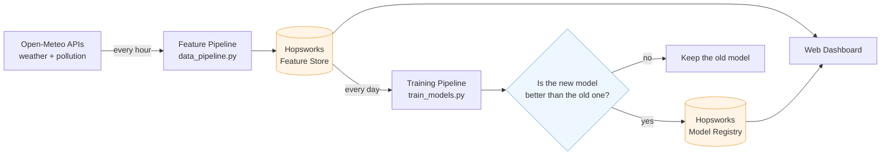
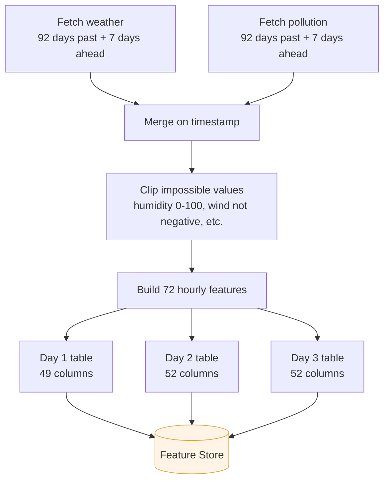
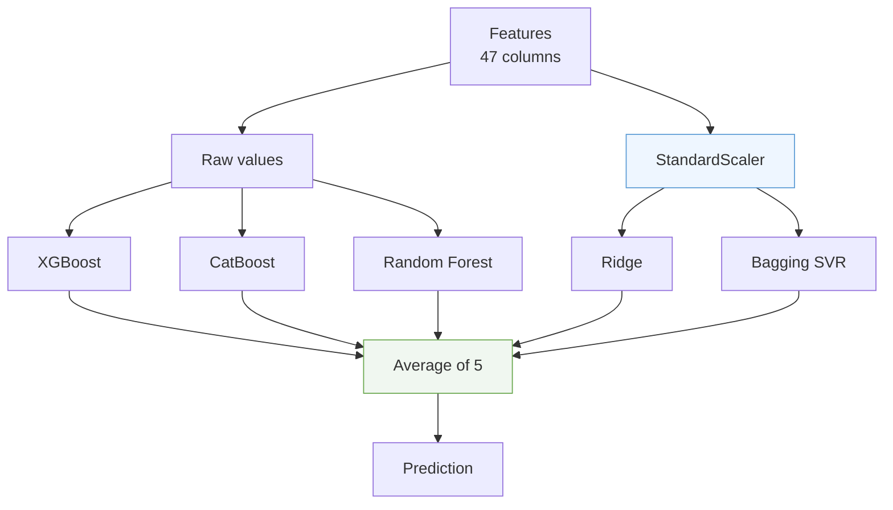
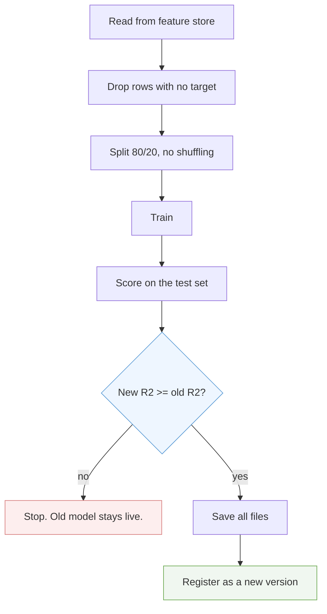

# Karachi AQI Predictor

This project predicts the AQI (Air Quality Index) for Karachi city one, two, and three days ahead.

Every hour, through git actions, the script pulls the updated weather and pollution data, builds the features, and saves them into the Hopsworks feature store. And every day, the training script runs and retrains the model, and if it is better than the old model, the old one gets replaced.

This project is built for the 10Pearls Shine internship program.

---

## Current status

| Piece                     | State                                          |
| ------------------------- | ---------------------------------------------- |
| Feature pipeline (hourly) | Running on GitHub Actions                      |
| Training pipeline (daily) | Running on GitHub Actions                      |
| Feature store             | 1,125 daily rows, Aug 2023 to today            |
| Model registry            | 3 models registered                            |
| Web dashboard             | In progress                                    |
| SHAP explanations         | Done in notebooks(XGB the one which is in use) |

---

## Results

The single R2-score will not give much insight into errors. The model can score 0.8 on easy stretch data and 0.4 on hard stretch data. So the model is evaluated with each and every kind of metrics as is shown below next to a **persistence baseline** which is the dumbest forecast, as it just says "tomorrow's AQI will be the same as today's".

| Horizon | Model         | R2    | Baseline R2 | Gain       | MAE  |
| ------- | ------------- | ----- | ----------- | ---------- | ---- |
| Day 1   | Tuned XGBoost | 0.837 | 0.552       | **+0.285** | 5.37 |
| Day 2   | 5-model blend | 0.553 | 0.190       | **+0.363** | 9.11 |
| Day 3   | 5-model blend | 0.511 | -0.081      | **+0.592** | 9.84 |

Now look at day 3 from the above table. The baseline is **negative** which means at 72 hours ahead, today's AQI is a worse guess from baseline's perspective. But the model still reaches 0.511 from weather forecasts and seasonal patterns, which is where the whole 0.592 gain comes from.

Day 1 is the only one that passes 0.7 bar. However, days 2 and 3 do not cross it, and maybe they can not do it with this data.
Three days out, air quality in Karachi is mostly driven by wind and weather systems that the forecast data only partly captures.

---

## How the whole thing fits together



Two scripts, two schedules, one shared store. The dashboard reads the model from the registry and the latest features from the feature store, then works out the prediction itself.

---

## The data

All the data is coming from **Open-Meteo**, which has two endpoints:

- **Weather** — temperature, wind speed, wind gusts, wind direction, humidity, dew point, surface pressure, boundary layer height, cloud cover, rainfall, solar radiation
- **Air quality** — PM2.5, PM10, carbon monoxide, nitrogen dioxide, sulphur dioxide, ozone, dust, aerosol optical depth, and the US AQI value itself

Location is fixed to Karachi (24.8608 N, 67.0104 E).

Both endpoints return hourly readings. The history goes back to **4 August 2023**, which gives a bit over two years of data and covers two full winter smog seasons.

### Why the data is daily, not hourly

I initially started with the hourly rows, but results were not good. So I did an experiment on daily averages and it was much better:

| Model         | Hourly R2 | Daily R2  |
| ------------- | --------- | --------- |
| XGBoost Day 1 | 0.625     | **0.836** |
| XGBoost Day 2 | 0.349     | **0.555** |
| XGBoost Day 3 | 0.292     | **0.503** |

The data pipeline **collects** hourly data because the rolling windows and lag features needs it and at the end it aggregates to daily.

---

## Feature pipeline



### What features get built

**Time features** — hour, day of month, month, day of week, quarter.

**Lag features** — AQI one hour ago, AQI 24 hours ago, and the rate of change.

**Rolling statistics** — mean and standard deviation of AQI over the past 6, 24, and 72 hours, plus an exponentially weighted mean. All of them shifted by one hour first, so the current reading never leaks into its own rolling window.

**Future weather** — this is the important one. For ten weather variables, the pipeline pulls the value 24, 48, and 72 hours ahead and stores it as `f24_temperature_2m`, `f48_wind_speed_10m`, and so on. These are forecasts, not measurements, and they are what let the model see ahead at all.

**Domain features** — three that come from how pollution actually behaves:

- `wind_pollution_dispersion` = wind speed multiplied by boundary layer height. Strong wind plus a tall mixing layer means pollution spreads out and AQI drops.
- `pressure_change_3hour` = how much surface pressure moved in three hours. Catches weather systems moving in.
- `humidity_level` = temperature minus dew point. A cheap way to measure how dry the air is.

**Cyclic features** (Day 2 and Day 3 only) — sine and cosine of day-of-year and day-of-week. Without these, the model treats 31 December and 1 January as far apart, when they are next-door days with near-identical weather.

**Delta features** (Day 2 and Day 3 only) — future weather minus today's weather. Instead of "temperature will be 32 degrees", the model sees "temperature will be 4 degrees warmer than now". The change turned out to matter more than the level.

### Why the API endpoint had to change

The first version used Open-Meteo's **archive** endpoint. It worked for the backfill and gave clean history.

Then the live pipeline broke. Every `f24`, `f48`, and `f72` feature came out empty for the most recent rows.

The reason: those features are built with `shift(-24)`, which looks _forward_ in the table. The archive endpoint only returns the past and lags a few days behind. There were no future rows to shift from.

The fix was to switch to the **forecast** endpoint with `past_days=92` and `forecast_days=7`. That returns history and forecast in one call, so the forward-looking features have real numbers in them right up to today.

One side effect worth knowing: the forecast endpoint holds roughly 77 days of history, not the 92 requested. The pollution endpoint gives all 92, the weather endpoint does not. So the merged window ends up around 76 usable days. That is fine — the pipeline is only topping up recent days, and the full history already sits in the feature store.

---

## Feature store

The feature groups in Hopsworks are as follows:

```
aqi_daily_day1   50 columns   time + 48 features + 1 target
aqi_daily_day2   53 columns   time + 51 features + 1 target
aqi_daily_day3   53 columns   time + 51 features + 1 target
```

All of them uses `time` as the primary key, with the format of HUDI table. That means **inserts are upserts**. If a day exists it will be updated automatically, otherwise if it is new it gets added. Also, running the pipeline does not create any duplicates and **a missed run is fully repaired by the next run.**

### The store holds more than the models use

Thye feature group contains 51 features total for Day 2 and 3, but the model uses only 47 columns as the four columns `boundary_layer_height`, `f48/f72_boundary_layer_height`, `wind_pollution_dispersion` and `delta_boundary_layer_height`, remains in the store but get dropped before the training because they have alot of missing values, and dropping them helped the model to run the pattern efficiently.

And storing these features in the feature store is on purpose, if in case if the model needs to use it maybe for next month, so it will be already in the feature store.

### Today's row has no target

On every run the pipeline writes current rows features and the target column empty, because the AQI has not happened yet. The row become useless for the training, and it gets drop. But it is exactly the row training model needs it to make the predictions of ahead, so the pipeline keeps it and lets the training script filter it out.

---

## Models

### What I tried

| Model                                   | Day 1 R2  | Notes                             |
| --------------------------------------- | --------- | --------------------------------- |
| Persistence baseline                    | 0.552     | "Tomorrow equals today"           |
| Facebook Prophet (plain)                | 0.003     | No better than guessing           |
| Facebook Prophet (+ weather regressors) | 0.518     | Still below the baseline          |
| LSTM                                    | 0.590     | Slight gain, much more complexity |
| CatBoost                                | 0.840     | Very close to XGBoost             |
| **Tuned XGBoost**                       | **0.837** | Picked this one                   |

### Day 1: single tuned XGBoost

Day 1 model is tuned with `RandomizedSearchCV` that is 100 combinations of random parameters as well as scored with `TimeSeriesSplit` so the validation folds always come after the training folds.

The search found: 1800 trees, learning rate 0.01, depth 6, and fairly heavy regularisation.

**We do not do tuning in the automation pipeline** because it can take 30 to 40 minutes on Github's gpu, and it would give almost same answer. So, the winning parameters are written straight into `train_functions.py`.

### Day 2 and Day 3: five models averaged

One model was not good for longer horizons, so decided to blend 5 models:



### Feature importance

SHAP was run on all the models, answering the questions like for one prediction, which features helped to raise the AQI up and which not.

Every model got its own two plots i.e a **waterfall plot** that shows step by step break down of a single day, and a **beeswarm plot** that shows which features matter the most.

---

## Training pipeline



### The champion/challenger gate

This is the the part that keeps the whole process safe.

Everyday a new fresh models is trained. Before it gets to the registry, its R2 score is compared against the current model. If it is bad then the old model stays.

Without this gate, one bad model would make the whole system worse. If the API returns the junk for few hours, the model trains on this and scores 0.4 instead of 0.83. It would be saved in the registry, the dashboard and api will also use this. The predictions will just go silently worse.

 **The gate blocks models, not data.** Fresh current features will keep coming in the store every hour.

---

## Automation

There are two actions workflows are as follows:

**`data_pipeline.yml`** — It runs at every hour. Fetches and builds the features and then it is stored.

**`train_pipeline.yml`** — It runs daily at 02:30 UTC (07:30 Karachi time), so it trains on fresh data.

### One thing about GitHub's scheduler

Also recently I learned about the hourly cron does not actually fire every hour because for a Github free tier it can be delayed or skips the scheduled as the server might be busy, but every run upserts a full 76-day window keyed on date, and a skipped run is also repaired by the next run.

---

## Repository layout

```
.github/workflows/
    data_pipeline.yml         hourly feature job
    train_pipeline.yml        daily training job

AQI Predictor/
    Feature_Pipeline/
        functions.py          8 functions: fetch, clean, features, push
        data_pipeline.py      runs them in order
        Feature _Collection.ipynb    how the API calls were worked out
        Feature_Preparation.ipynb    how the features were designed
        Feature_Store.ipynb          feature group setup and backfill
        Eda_Daily.ipynb              EDA on daily data
        Eda_Hourly.ipynb             EDA on hourly data

    Training_Pipeline/
        train_functions.py    11 functions: read, prep, train, score, gate, register
        train_models.py       runs all three horizons

    Models/
        XGBoost/              Day 1, 2, 3 - tuning, SHAP, registration
        CatBoost/             Day 1, 2, 3 comparison runs
        Facebook Prophet/     Day 1 attempt
        LSTM/                 Day 1 attempt
        Model Evaluation.xlsx hourly vs daily comparison

    Registered_Models/        local copies of what is in the registry
    Data/                     raw and processed CSVs from the backfill
    requirements.txt          light, for the hourly job
    requirements-train.txt    heavy, for the daily job
```

The notebooks are kept exactly as they were run. They are the record of how each decision was reached. All fixes went into the pipeline scripts instead, so the notebooks still show the original numbers.

---

## Running it yourself

```bash
git clone https://github.com/Sameen20-bot/10-Pearls-AQI-Predictor.git
cd "10-Pearls-AQI-Predictor/AQI Predictor"
```

Put your Hopsworks key in a `.env` file at the `AQI Predictor` level:

```
HOPSWORK_KEY=your_key_here
```

Feature pipeline:

```bash
pip install -r requirements.txt
cd Feature_Pipeline
python data_pipeline.py
```

Training pipeline:

```bash
pip install -r requirements-train.txt
cd Training_Pipeline
python train_models.py
```

Python 3.13. Package versions are pinned in both requirements files so CI matches local.

---

## Stack

Python, pandas, NumPy, scikit-learn, XGBoost, CatBoost, SHAP, Prophet, Keras, Hopsworks, GitHub Actions, Open-Meteo.
